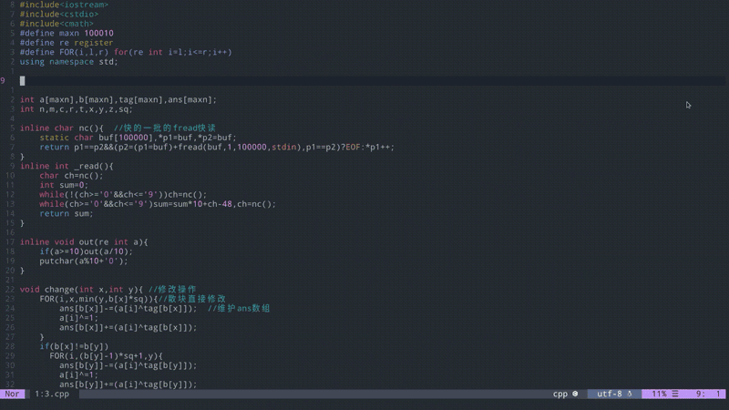
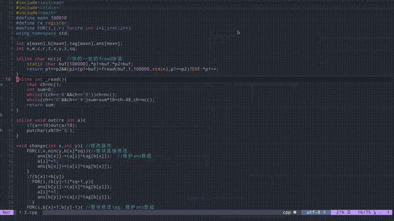
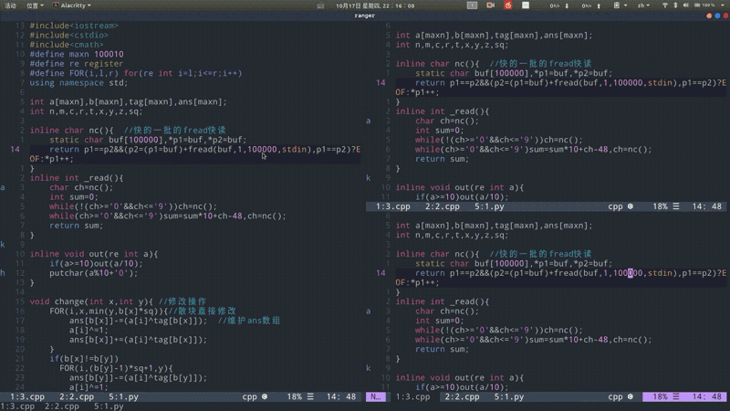
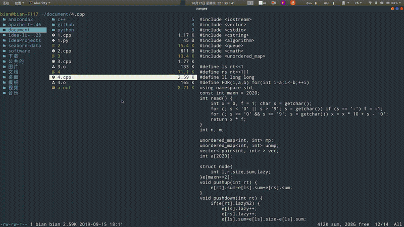
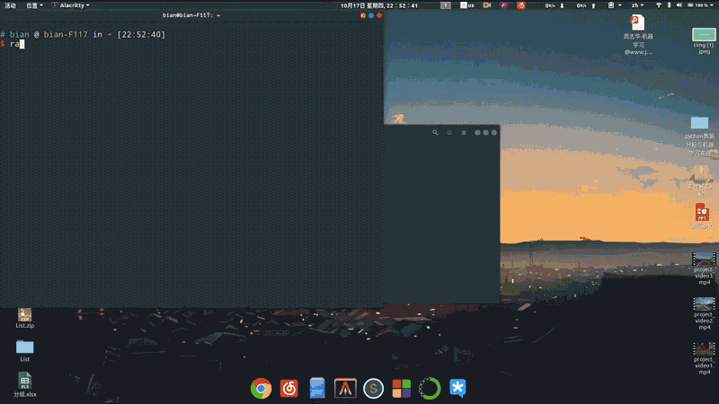
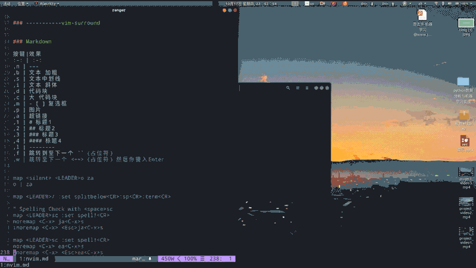

 

 

 

 

 

 

 

# 基本操作简述
| 快捷键             | 作用                              | 映射                           |
| :----------------- | :-------------------------------- | :----------------------------- |
| `ci"`              | ""内文字删除并进入插入模式        |                                |
| `ciw`              | 在单词内,删除该单词并进入插入模式 |                                |
| `di"`              | ""内文字删除不进入插入模式        |                                |
| `df<any>`          | 删除到<any>                       |                                |
| `/<any>`           | 正则表达式搜索                    |                                |
| `/小写`            | 大小写均可匹配                    |                                |
| `/大写`            | 严格匹配                          |                                |
| `批量选中下I<any>` | 在所有可视块前加<any>，<esc>结束  |                                |
| `批量选中下A<any>` | 在所有可视块后加<any>，<esc>结束  |                                |
| `sl`               | 右分屏                            | :set splitright<CR>:vsplit<CR> |
| `sh`               | 左分屏                            |                                |
| `sk`               | 上分屏                            |                                |
| `sj`               | 下分屏                            | :set splitbelow<CR>:split<CR>  |
| `<space>I`         | 切换到右分屏                      | <C-w>l<C-w>t<C-w>K             |
| `<space>h`         | 切换到左分屏                      | <C-w>h                         |
| `<space>k`         | 切换到上分屏                      | <C-w>k                         |
| `<space>j`         | 切换到下分屏                      | <C-w>j                         |
| `<RIGHT>`          | 增大右分屏5 size                  | :vertical resize+5<CR>         |
| `<LEFT>`           | 增大左分屏5 size                  | :vertical resize-5<CR>         |
| `<UP>`             | 增大上分屏5 size                  | :res +5<CR>                    |
| `<DOWN>`           | 增大下分屏5 size                  | :res -5<CR>                    |
| `sv`               | 转为左右分屏                      | <C-w>t<C-w>H                   |
| `sp`               | 转为上下分屏                      | <C-w>t<C-w>K                   |
| `sV`               | 转为左右分屏并交换                | <C-w>b<C-w>H                   |
| `sP`               | 转为上下分屏并交换                | <C-w>b<C-w>K                   |
| `ta`               | 创建一个新的tabe                  | :tabe<CR>                      |
| `tj`               | 切换到下一个tabe                  | :+tabnext<CR>                  |
| `tk`               | 切换到上一个tabe                  | :-tabnext<CR>                  |
| `trj`              | 移除下一个tabe                    | :+tabmove<CR>                  |
| `trk`              | 移除上一个tabe                    | :-tabmove<CR>                  |
| `ff`               | 文件树                            |                                |
| `:help 插件`       | 查看插件文档                      |                                |
| `<space>tm`        | 横向补全格式                      |                                |
| `<space>gy`        | 窗口模式转换为简洁模式            |                                |
| `m 字母`           | 加书签                            |                                |
| `m Space`          | 跳转书签                          |                                |
| `m /`              | 列出书签                          |                                |
| `mn`               | 下一个书签                        |                                |
| `mp`               | 上一个书签                        |                                |
| `dm/`              | 删除所有书签                      |                                |
| `<S-i>`            | 显示文件的历史版本                |                                |
| `<space>fd`        | 高亮附近重复的单词                |                                |
| `<space>sc`        | 进入set spell!模式                |                                |
| `[s`               | 上一个拼写错误                    |                                |
| `s]`               | 下一个拼写错误                    |                                |
| `z=`               | 单词列表                          |                                |
| `Ctrl o`           | 回到上次光标位置,可跨文件         |                                |
| `Ctrl i`           | 回到上次之前的位置                |                                |
| `gf`               | 切换进入该文件                    |                                |
| `:w !sudo tee %`   | 运行sudo保存该文件                |                                |
| `tx`               | 打印ASC字符                       | :r !figlet                     |
| `:%TOhtml`         | 打印成html                        |                                |

# Basic
| 快捷键    | 作用                        | 映射                           |
| :------- | :-------------------------- | :----------------------------- |
| `;`      |                             | :                              |
| `Q`      | 退出                        | :q<CR>                         |
| `S`      | 保存退出                    | :w<CR>                         |
| `<`      | Indentation                 | <<                             |
| `>`      | Indentation                 | >>                             |
| `=`      | Search                      | nzz                            |
| `-`      | Search                      | Nzz                            |
| `H`      | 行首                        | 0                              |
| `L`      | 行末                        | $                              |
| `J`      | 向下五行                    | 5j                             |
| `K`      | 向上五行                    | 5k                             |
| `W`      | 向后五个单词                | 5w                             |
| `B`      | 向前五个单词                | 5b                             |
| `<C-K>`  | 仅移动视图                  | 5<C-k><CR>                     |
| `<C-J>`  | 仅移动视图                  | 5<C-j><CR>                     |
| `st`     | Open Startify               | :Startify                      |
| `rc`     | Open the vimrc file anytime | :e ~/.config/nvim/init.vim<CR> |
| `s`      | Disabling the default s key | <nop>                          |
| `Y`      | Copy to system clipboard    | :w !xclip -i -sel c<CR>        |
| `R`      | .vim重新加载                |                                |

# 分屏
| 快捷键              | 作用                              | 映射                                                |
| :----------------- | :-------------------------------- | :-------------------------------------------------- |
| `sl`               | 右分屏                            | :set splitright<CR>:vsplit<CR>                      |
| `sh`               | 左分屏                            | :set nosplitright<CR>:vsplit<CR>:set splitright<CR> |
| `sk`               | 上分屏                            | :set nosplitbelow<CR>:split<CR>:set splitbelow<CR>  |
| `sj`               | 下分屏                            | :set splitbelow<CR>:split<CR>                       |
| `<space>I`         | 切换到右分屏                      | <C-w>l<C-w>t<C-w>K                                  |
| `<space>h`         | 切换到左分屏                      | <C-w>h                                              |
| `<space>k`         | 切换到上分屏                      | <C-w>k                                              |
| `<space>j`         | 切换到下分屏                      | <C-w>j                                              |
| `<RIGHT>`          | 增大右分屏5 size                  | :vertical resize+5<CR>                              |
| `<LEFT>`           | 增大左分屏5 size                  | :vertical resize-5<CR>                              |
| `<UP>`             | 增大上分屏5 size                  | :res +5<CR>                                         |
| `<DOWN>`           | 增大下分屏5 size                  | :res -5<CR>                                         |
| `sv`               | 转为左右分屏                      | <C-w>t<C-w>H                                        |
| `sp`               | 转为上下分屏                      | <C-w>t<C-w>K                                        |
| `sV`               | 转为左右分屏并交换                | <C-w>b<C-w>H                                        |
| `sP`               | 转为上下分屏并交换                | <C-w>b<C-w>K                    					  |

# Tabe管理
| 快捷键              | 作用                              | 映射                                                |
| :----------------- | :-------------------------------- | :-------------------------------------------------- |
| `ta`               | 创建一个新的tabe                  | :tabe<CR>                                           |
| `tj`               | 切换到下一个tabe                  | :+tabnext<CR>                                       |
| `tk`               | 切换到上一个tabe                  | :-tabnext<CR>                                       |
| `trj`              | 移除下一个tabe                    | :+tabmove<CR>                                       |
| `trk`              | 移除上一个tabe                    | :-tabmove<CR>                                       |

# 一键编译运行

| 语言     | 效果                | 快捷键 |
| -------- | ------------------- | ------ |
| `C/C++`  | 编译运行            | r      |
| `java`   | 编译                | r      |
| `sh`     | 运行                | r      |
| `python` | 运行                | r      |
| `html`   | MarkdownPreview浏览 | r      |

#### ===================== 插件配置 =====================

# Airline

| 符号   | 简写 |
| ------ | ---- |
| `n`    | Nor  |
| `i`    | Ins  |
| `R`    | Rpl  |
| `c`    | Cmd  |
| `v`    | Vis  |
| `V`    | Vli  |
| ``     | Vbl  |
| `s`    | S    |
| `S`    | S    |
| ``     | S    |

 

# NERDTree

| 快捷键             | 作用                                       | 映射                       |
| ----------------- | ------------------------------------------ | -------------------------- |
| `ff`              | 开关NerdTree                               | NERDTreeToggle             |
| `, (in NERDTREE)` | 开关菜单 NERDTreeMapMenu                   | NERDTreeMapMenu            |
| `L`               | 右侧分屏显示目录树、打开文件，并跳到该分屏 | NERDTreeMapOpenVSplit      |
| `l`               | 展开关闭文件夹、打开文件                   | NERDTreeMapActivateNode    |
| `H`               | 打开上一级目录不展开                       | NERDTreeMapUpdir           |
| `h`               | 打开上一级目录并展开                       | NERDTreeMapUpdirKeepOpen   |
| `r`               | 设置选中文件夹为Root目录                   | NERDTreeMapChangeRoot      |
| `a`               | 显示隐藏文件                               | NERDTreeMapToggleHidden    |
| `o`               | 打开文件、目录或书签，并跳到该Tabe窗口     | NERDTreeMapOpenInTab       |
| `O`               | 递归打开选中 结点下的所有目录              | NERDTreeMapOpenInTabSilent |

# NERDTree-git

| 代表     | 英文      | 符号 |
| ------- | --------- | ---- |
| `修改`   | Modified  | ✹    |
| `增加`   | Staged    | ✚    |
| `未追踪` | Untracked | ✭    |
| `重命名` | Renamed   | ➜    |
| `未合并` | Unmerged  | ═    |
| `已删除` | Deleted   | ✖    |
| `异常`   | Dirty     | ✗    |
| `常规`   | Clean     | ✔︎    |
| `未知`   | Unknown   | ?    |

# Spelling Check

 ~/.config/coc/extensions/node_modules/coc-snippets/spell

| 快捷键       | 作用                   | 映射            |
| ----------- | ---------------------- | --------------- |
| `<space>sc` | 启动拼写检查           | :set spell!<CR> |
| `]s`        | 移动到下一个拼写错误处 |                 |
| `[s`        | 移动到上一个拼写错误处 |                 |
| `z=`        | 选择正确的拼写         |                 |
| `zg`        | 添加用户拼写           |                 |
| `zw`        | 删除用户拼写           |                 |

# ranger.vim

| 快捷键    | 作用       | 映射 |
| -------- | ---------- | ---- |
| `R`      | 启动ranger |      |

# NCM2

| 快捷键     | 作用         | 映射 |
| --------- | ------------ | ---- |
| `<Tab>`   | 下一个匹配项 |      |
| `<S-Tab>` | 上一个匹配项 |      |

# COC

| 快捷键       | 作用                            | 映射 |
| ----------- | ------------------------------- | ---- |
| `<space> y` | 获取(yank)(vim的剪切板)历史列表 |      |
| `gd`        | 跳转至定义                      |      |
| `gr`        | 列出引用                        |      |
| `gi`        | 列出实现                        |      |
| `gy`        | 跳转至类型定义                  |      |
| `<space>rn` | 函数、变量批量重命名            |      |

# Markdown

source ~/.config/nvim/snippits.vim

| 按键    | 作用                  | 映射                |
| ------ | --------------------- | ------------------- |
| `,f`   | <++>                  |                     |
| `,w`   | <++>并回车            |                     |
| `,n`   | 分割线                |                     |
| `,b`   | 加粗                  |                     |
| `,s`   | 删除线                |                     |
| `,i`   | 斜体                  |                     |
| `,d`   | 行代码                |                     |
| `,c`   | 代码块                |                     |
| `,m`   | 待办事宜----Todo 列表 |                     |
| `,p`   | 图片                  | ![alt] (url"title") |
| `,a`   | 超链接                |                     |
| `,1`   | 一级标题              |                     |
| `,2`   | 二级标题              |                     |
| `,3`   | 三级标题              |                     |
| `,4`   | 四级标题              |                     |
| `,>`   | 引用无序              |                     |

# Taglist

| 快捷键    | 作用                               |      |
| -------- | ---------------------------------- | ---- |
| `T`      | 打开Taglist                        |      |
| `<CR>`   | 跳到光标下tag所定义的位置          |      |
| `o`      | 展开、折叠tag                      |      |
| `u`      | 更新窗口内tag                      |      |
| `s`      | 在按名字排序和按出现顺序排序间切换 |      |
| `x`      | taglist窗口放大和缩小              |      |
| `+`      | 打开一个折叠，同zo                 |      |
| `-`      | 将tag折叠起来，同zc                |      |
| `*`      | 打开所有的折叠，同zR               |      |
| `=`      | 将所有tag折叠起来，同zM            |      |
| `q`      | 关闭Taglist                        |      |

#  vim-table-mode

| 快捷键         | 作用             |      |
| ------------- | ---------------- | ---- |
| `<space>tm`   | table mode 开关  |      |
| `<space>tt`   | \|分隔符插入表格 |      |
| `<space>tr`   | 重新对齐         |      |
| `[\|`         | 移动到前一个表格 |      |
| `]\|`         | 移动到下一个表格 |      |
| `{\|`         | 移动到上一个表格 |      |
| `}\|`         | 移动到下一个表格 |      |
| `5[\|`        | 移动到前五个表格 |      |
| `\|\|`        | 插入表头边框     |      |
| `<Leader>tdd` | 删除一行         |      |
| `<Leader>tdc` | 删除一列         |      |

# FZF

| 快捷键   | 作用    |      |
| -------- | ------- | ---- |
| `<C-f>`  | 打开FZF |      |

# vim-signature

| 快捷键     | 作用                     |      |
| ---------- | ------------------------ | ---- |
| `m<any>`   | 用<any>标记当前行        |      |
| `m,`       | 用下一个未使用的字母标记 |      |
| `m.`       | 取消当前标记             |      |
| `dm-`      | 取消当前行所有标记       |      |
| `dm<any>`  | 取消<any>标记            |      |
| `dm/`      | 取消所有标记             |      |
| `m<space>` | 下一个标记(标记)         |      |
| `mn`       | 下一个标记(行)           |      |
| `mp`       | 上一个标记(行)           |      |

# Undotree

| 快捷键   | 作用               |      |
| -------- | ------------------ | ---- |
| `U`      | 打开Undotree       |      |
| `J`      | 返回上一个历史状态 |      |
| `K`      | 返回下一个历史状态 |      |

# vim-multiple-cursor

| 快捷键   | 作用                   |      |
| -------- | ---------------------- | ---- |
| `<C-d>`  | 选择下一个单词(多光标) |      |
| `<C-u>`  | 选择上一个单词         |      |
| `<C-x>`  | 跳过下一个单词         |      |
| `Esc`    | 退出多光标模式         |      |

# thesaurus_query

| 快捷键      | 作用       |                                      |
| ----------- | ---------- | ------------------------------------ |
| `<space>th` | 获取同义词 | :ThesaurusQueryLookupCurrentWord<CR> |

# Startify

| 快捷键      | 作用             |      |
| ----------- | ---------------- | ---- |
| `<space>st` | Startify启动界面 |      |

# Far.vim

| 快捷键      | 作用 | 映射              |
| ----------- | ---- | ----------------- |
| `<space>fa` |      | :F  %<left><left> |
| `<space>fr` |      | :Farp<CR>         |

# fzf-gitignore

| 快捷键   | 作用       |      |
| -------- | ---------- | ---- |
| `gf`     | 打开该文件 |      |

# vim-calc

| 快捷键   | 作用   |      |
| -------- | ------ | ---- |
| `<C-a>`  | 数字+1 |      |

# Emmet
| 快捷键               | 作用                                   |  |
|----------------------|----------------------------------------|--|
| html:5<C-y>          | html模板                               |  |
| div>p#foo$*3<C-y>    | div嵌套p                               |  |
| ul>li*3<C-y>         | ul嵌套li                               |  |
| <C-y> d              | 插入模式下根据光标位置选中整个标签     |  |
| <C-y> D              | 插入模式下根据光标位置选中整个标签内容 |  |
| <C-y> n              | 跳转到下一个编辑点                     |  |
| <C-y> N              | 跳转到上一个编辑点                     |  |
| 在img标签处<C-y> i   | 更新图片大小                           |  |
| 选中多个<li> <C-y> m | 合并行                                 |  |
| <C-y> k              | 移除标签对                             |  |
| <C-y> j              | 分割/合并标签                          |  |
| <C-y> /              | 切换注释                               |  |
| <C-y> a              | 从URL地址生成锚                        |  |
| <C-y> A              | 从URL地址生成引用文本                  |  |

# 其它有用的配置

| 快捷键           | 作用                      | 映射                                |
| ---------------- | ------------------------- | ----------------------------------- |
| `<space>fd`      | 找到两个连续一样的字符    | /\(\<\w\+\>\)\_s*\1                 |
| `<space>/ `      | Opening a terminal window | :set splitbelow<CR>:sp<CR>:term<CR> |
| `tx`             | Call figlet               | :r !figlet                          |
| `<space><space>` | 寻找最近的<++>            |                                     |
